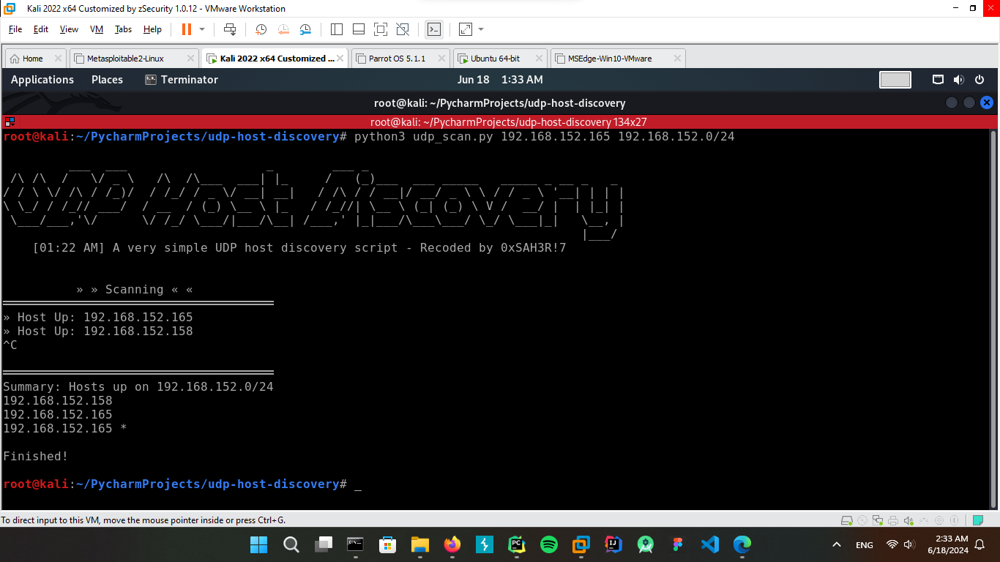

# UDP Host Discovery

<p align="center">
  
</p>

      

This Python script allows you to scan a network and discover devices within a specified subnet mask. It sends a UDP
datagram to a closed port on a host, that host typically sends back an ICMP message indicating that the port is
unreachable , this ICMP message tells us there is a host alive. Because if there was no host, we probably wouldn't
receive any response to the UDP datagram.

## Screenshots



## Usage

- Pass the `host_ip` address which is your current host machine to listen on, and pass `target_subnet` which is your
  target subnet mask to perform scan

```commandline
python3 192.168.1.7 192.168.1.0/24
```

## Why choosing UDP?

Well, there's no overhead in spraying the message across an entire subnet and waiting for the ICMP responses to arrive
accordingly

## Acknowledgement

**This python script provided by Black Hat Python - 2nd Edition book for self learning**
